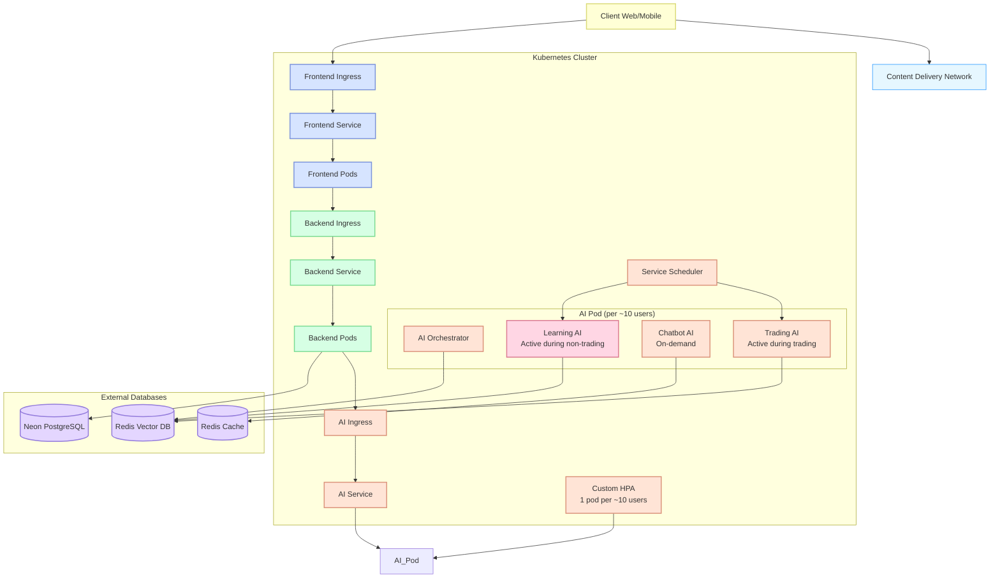

# Distributed System Architecture(s)

So the Main Reason We are looking into this Distributed System Archiecture is due to the fact that an instance of the AI Service must be running for a long or continous time period, with no end. And this would cause a lot of problems in the sense of scalability and performance and resource intensivity.

So what we are going go through within this document is just the DevOps Related Methods which we could folow to resolve this issue. and at the end I will discuss regarding the other way's in which we can resolve this issue as well.

## System Components Overview

Our system consists of three main components that need to scale differently based on resource requirements:

1. **Frontend**: Client-facing interface hosted on standard EC2 instances
2. **Backend**: Core application logic also running on EC2 instances
3. **AI Service**: Resource-intensive component using serverless architecture where possible

The Frontend and Backend communicate via RESTful APIs (with potential for GraphQL integration in the future). The Backend and AI Service communicate using both WebSockets (for real-time data) and REST endpoints.

### AI Service Decomposition

The AI Service is further broken down into:

- Trading AI Service - active during trading sessions, dormant during learning periods
- ChatBot AI Service - active only when users are actively engaging with it
- Learning AI Service - active during non-trading periods, alternating with Trading AI Service

This alternating activation pattern between Trading and Learning services allows us to optimize resource usage, as they don't need to run simultaneously. The ChatBot service scales independently based on actual user interaction.

## Orchestration

### Kubernetes

Kubernetes provides a robust framework for our distributed architecture. We'll leverage:

- **Horizontal Pod Autoscaler (HPA)**: To dynamically scale our AI Service pods based on CPU/memory usage
- **Custom Metrics**: AI Service pods specifically scale based on number of connected users (targeting 1 pod per ~10 customers)
- **Ingress Controllers**: For efficient routing of API requests
- **ConfigMaps/Secrets**: To manage configuration and sensitive credentials

Our implementation will use a multi-tier approach where:

- Frontend and Backend pods scale based on general load metrics
- AI Service pods scale aggressively (1 pod per ~10 active users)

## Type's of Instances

### Lambda Functions

For AI Service components with intermittent activity:

- Trading AI Service during non-trading hours
- Learning AI Service during its scheduled periods
- ChatBot AI Service during periods of low user engagement
- Data transformation/preprocessing
- Scheduled AI analysis tasks

### EC2 Instances

Our primary hosting method for predictable workloads:

- Frontend application (standard EC2 instances)
- Backend services (standard EC2 instances)
- Continuously running AI components (specialized instances)

## Within a Instance

### 1 Instance Multi Processing

Within each AI Service pod, we'll implement multi-processing:

- Multiple worker processes to handle concurrent requests
- Process pools for compute-intensive operations
- Load balancing across processes using a master-worker pattern
- Shared memory for inter-process communication where needed

This approach maximizes CPU utilization within a single pod.

### 1 Instance Async Processing

To maximize resource utilization, we'll implement:

- Event-driven architecture using async I/O
- Task queues for workload distribution
- Non-blocking operations for network and disk I/O
- Request batching for AI model inference when possible

## Database Architecture

Our system uses a multi-database approach optimized for different workloads, with databases hosted on their own cloud platforms (not within the Kubernetes clusters):

### Redis Vector Database

- Primary use: AI Service vector embeddings storage
- Hosted: Dedicated cloud Redis provider
- Used by: All AI Services for vector operations and embeddings

### Redis Cache

- Primary use: Specifically for ChatBot AI Service instruction storage and modification
- Purpose: Allows dynamic changes to chatbot instructions and behaviors
- Hosted: Managed Redis service

### Neon Postgres

- Primary use: Backend and Frontend specific relational data
- Data: Application state and relational data models
- Hosted: Managed Neon PostgreSQL service
- Purpose: Optimized for transaction processing and relational queries

## System Architecture Diagram

## Deployment Strategy

Each component will be versioned and deployed independently based on their specific scaling needs:

- **Frontend/Backend**: Standard EC2 deployments with load balancing, scaling based on general metrics like CPU/RAM usage and request counts
- **AI Services**: Custom scaling based on user connections, with the specific metric of ~10 users per AI Service pod to ensure optimal performance

  - Trading AI and Learning AI services alternate their active periods using a scheduler
  - ChatBot AI service activates only when users are interacting with it
  - This time-sharing approach allows resource optimization within each pod

- **Databases**: Externally managed services with their own scaling policies, connecting to our application components through secure endpoints

The multi-processing approach within AI Service instances will allow us to handle complex computational tasks efficiently, while the activity scheduling enables further cost optimization by ensuring services only run when needed.

## Resource Optimization Strategy

To maximize resource utilization with our alternating service pattern:

1. **Time-Based Scheduling**: The Service Scheduler activates Trading AI during market hours and Learning AI during off-hours
2. **Event-Driven Activation**: ChatBot services activate only in response to user requests
3. **Resource Sharing**: When one service is dormant, its allocated resources become available to active services within the same pod
4. **Graceful Transitions**: Services maintain state in the Redis databases during transitions to ensure continuity

This approach allows us to maintain the 1 pod per ~10 users ratio while optimizing resource usage by ensuring no resources are wasted on idle services.

## Kubernetes Resource Details

### Ingress Configuration

The Kubernetes cluster uses Ingress resources to manage external traffic:

- **Frontend Ingress**: Routes user traffic to the Frontend Service
- **Backend Ingress**: Manages API requests from the Frontend to Backend
- **AI Service Ingress**: Handles communication from the Backend to AI Services

### CDN Integration

Unlike the Frontend Service pods, the CDN exists as an external service outside the Kubernetes cluster. It serves static assets directly to clients, reducing load on our Frontend Pods which handle dynamic content and application logic.
